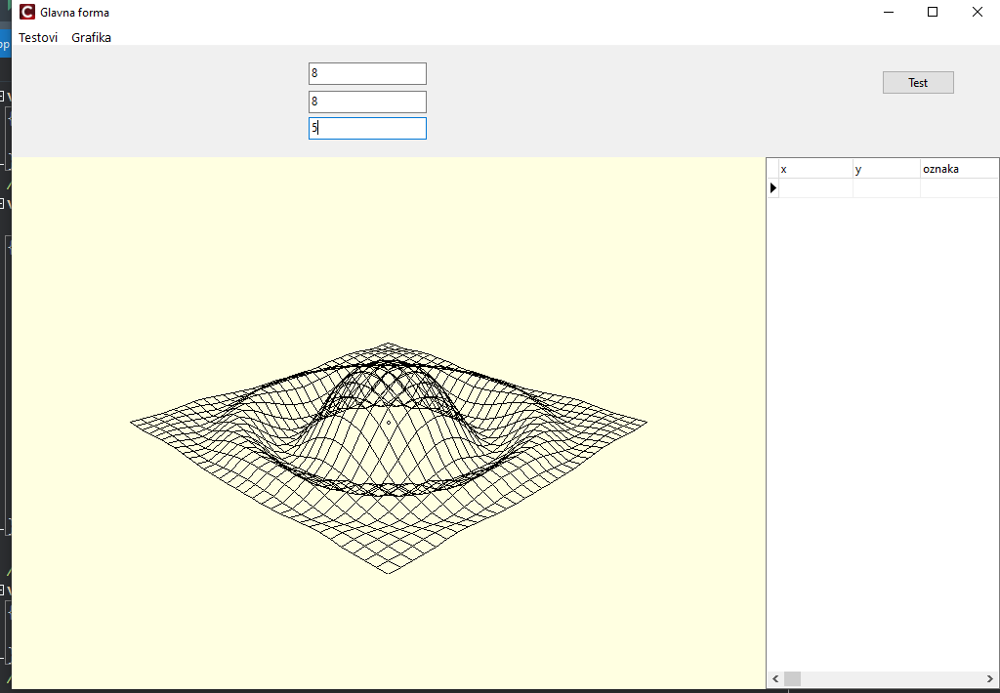
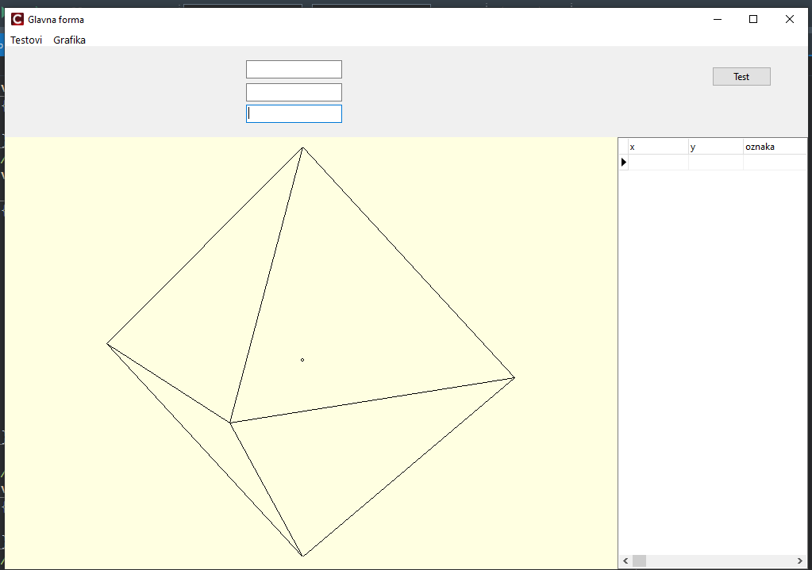
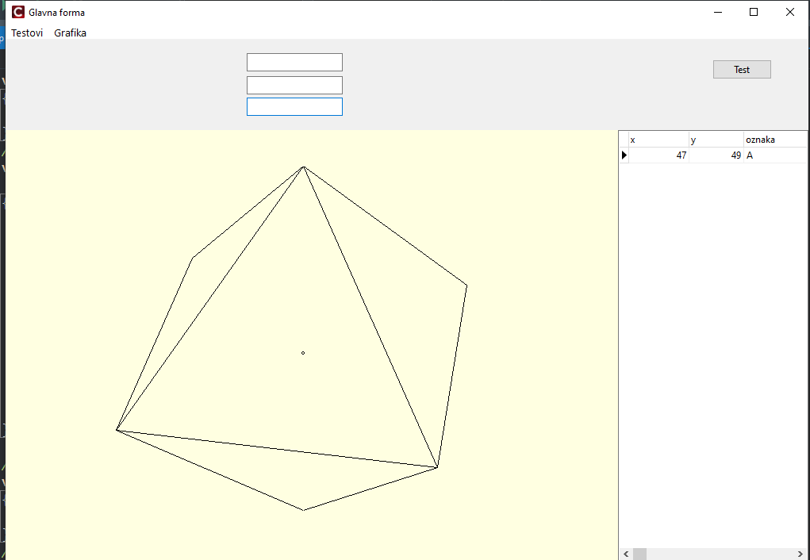
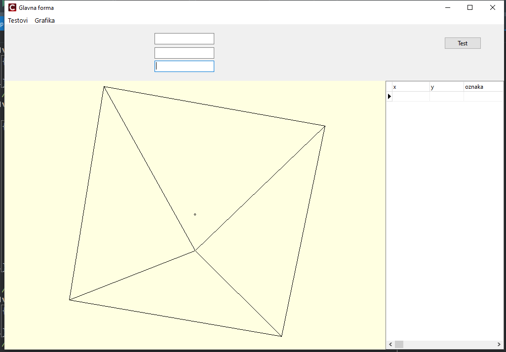
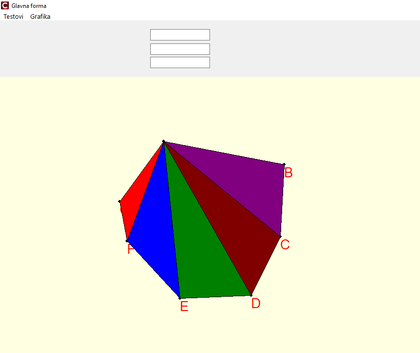
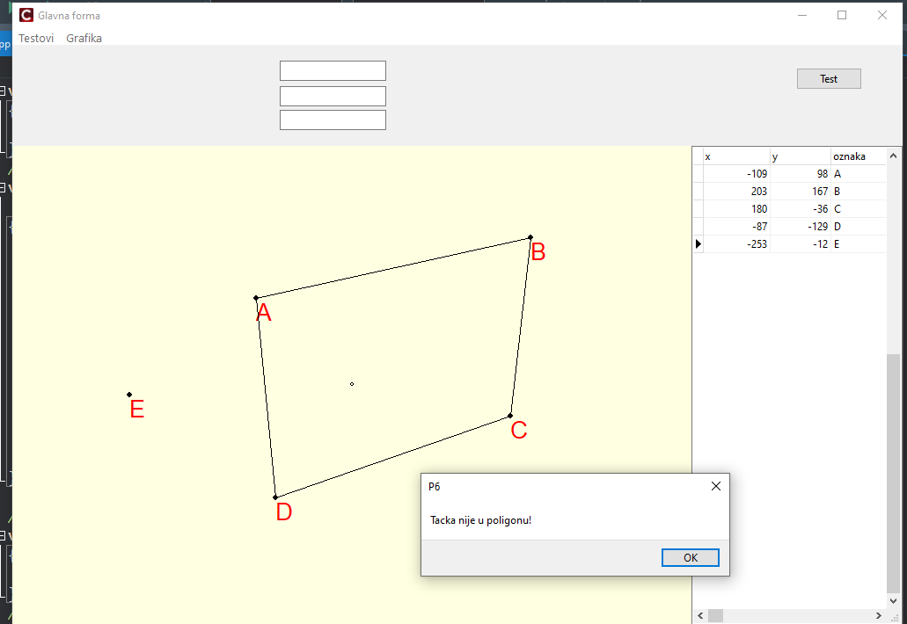

# Computer Graphics in C++

A small educational project developed in **C++ using Embarcadero C++Builder** as part of learning the fundamentals of computer graphics and computational geometry.

The main goal of this project was to get familiar with **C++Builder and VCL**, while implementing and visualizing several basic 2D and 3D graphics concepts and algorithms.

Through this project, I explored working with coordinate systems, geometric objects, polygon algorithms, 3D-to-2D projection, and simple 3D object visualization.

## Features

The application includes several interactive examples:

- Point orientation testing
- Line segment intersection
- Simple polygon construction
- Point-in-polygon testing
- Convex hull
- Polygon triangulation
- 3D mathematical function visualization
- 3D-to-2D perspective projection
- Loading 3D objects from a text file
- 3D object rotation and visualization
- Basic hidden-line processing

## 3D Function Visualization

The application can visualize a mathematical function as a 3D wireframe surface.

The surface is generated from a grid of 3D points and projected onto the 2D drawing area.



## 3D Object Loading and Rotation

A simple 3D object can be loaded from a text file containing its vertices and polygons.

After loading the object, it is projected onto the 2D screen using perspective projection. The viewing angle can also be changed to observe the object from different directions.

### Loaded object



### Different viewing angles

<p align="center">
  
  
</p>

## Polygon Triangulation

The project includes a basic polygon triangulation implementation.

A polygon defined by multiple points is divided into triangles, with different colors used to make the resulting triangulation easier to visualize.



## Point-in-Polygon Test

The application can test whether a selected point is located inside or outside a polygon.



## What I Practiced

This project helped me become more familiar with:

- C++ fundamentals in a graphical application
- Embarcadero C++Builder
- VCL components and event-driven programming
- Drawing on a 2D canvas
- Logical and screen coordinate systems
- Basic computational geometry
- Working with points, lines, triangles and polygons
- 3D coordinates and perspective projection
- Reading and representing 3D objects from files
- Visualizing mathematical functions in 3D

## Technologies

- **C++**
- **Embarcadero C++Builder**
- **VCL (Visual Component Library)**

## Project Structure

The project is organized into several classes responsible for graphical operations and geometric objects, including:

- `TGrafika` – drawing, transformations, projections and geometric algorithms
- `LogickaTacka` – representation of a 2D point
- `Logicka3DTacka` – representation of a 3D point
- `LogickiTrougao` – triangle representation
- `Logicki3DTrougao` – 3D triangle representation
- `Poligon` – polygon representation
- `Objekat` – representation and loading of a 3D object
- `TridOperator` – helper operations used with 3D geometry

## Running the Project

The project was developed using **Embarcadero C++Builder**.

To run it:

1. Clone this repository.
2. Open `P6.cbproj` in C++Builder.
3. Build the project.
4. Run the application.

```bash
git clone https://github.com/adix309/computer-graphics-cpp.git
```

## About

This is an educational project created while learning the basics of **computer graphics and computational geometry**.

It is not intended to be a full graphics engine, but rather a practical introduction to implementing and visualizing graphics algorithms directly in C++.
